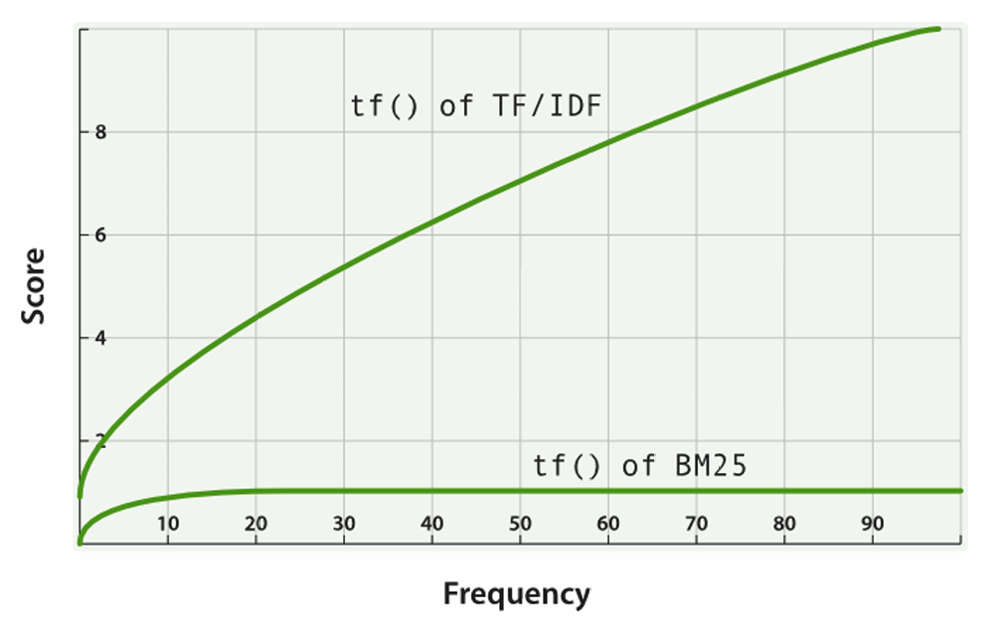
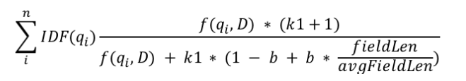
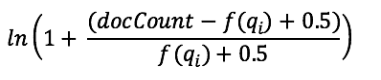
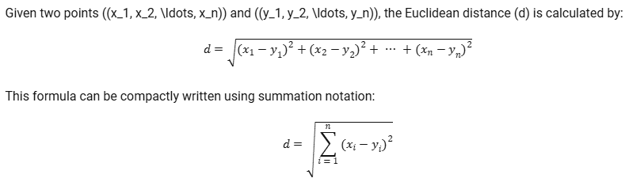
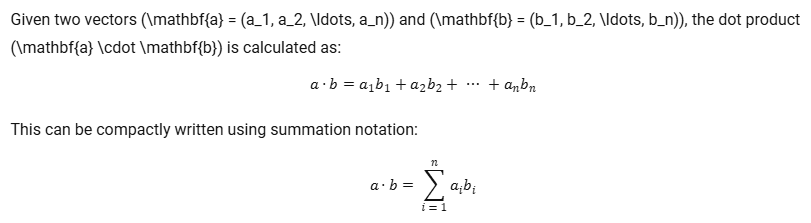
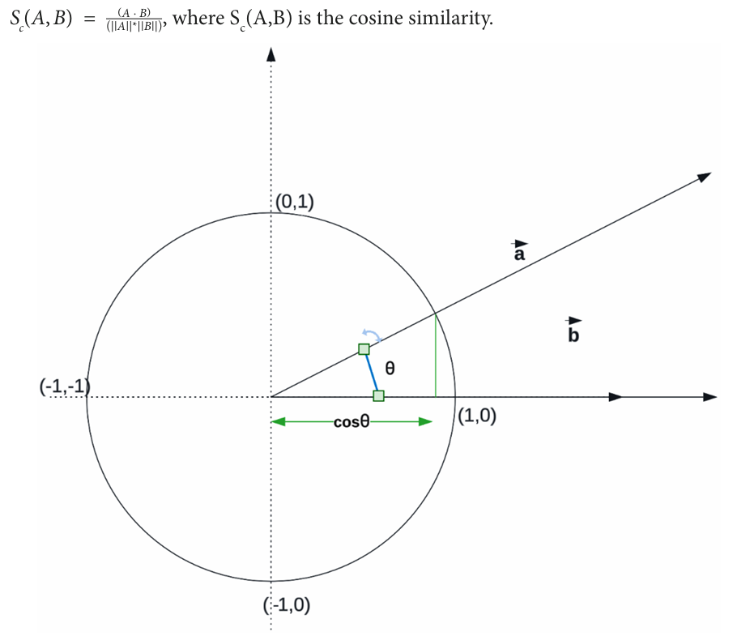

# Getting Started with Vector Search

## Data Type and its impact on relevancy
***Elasticsearch*** supports various data types. Among them, few can be categorized into two main types in the context of *relevancy ranking*. 
+ Data types which directly drives the *relevancy ranking*
	+ Text: It is used to store and search textual data. The *text data* is *analyzed* using built in *analyzers*. The *analyzers* break the text into *tokens* and perform operations such as *lowercasing, stemming, and filtering*.
	+ Geo: Used to store and search geographic coordinates. It enables to perform geo-based queries. Helps to narrow down search results and improve their relevancy. 
+ Data type that indirectly influence ranking
	+ Keyword: used to store *non-analyzed* text data. Mainly used for *filtering and aggregations*. It helps to refine the search results by filtering records aggregating. 
	+ Numeric Types (integer, float, double etc.): Used to store and search numeric data. Again useful to filter and sort search results. 
	+ Date: used to store and search date and time data. Used to filter and sort search results. 
		+ Boolean: used to store `true/false` values. Useful, to filter search results. 

## The ***Relevancy Model***

### TF-IDF Term Frequency-Inverse Document Frequency Algorithm 
Let's take an example: 
+ Document 1: "I love vector search. Vector search is amazing."
+ Document 2: "Vector search is a method for searching high-dimensional data."
+ Document 3: "Elasticsearch is a powerful search engine that supports vector search."

Let's see how we can calculate the *TF-IDF* score for the *term* **vector search** in each of the document. 

Calculating TF
+ Document 1: vector search appears twice out of 8 words -> TF = 2 / 8 = 0.25
+ Document 2: vector search appears once out of 9 words -> TF = 1/9 = 0.111
+ Document 3: vector search appears once out of 10 words -> TF = 1/10 = 0.110

Calculating IDF
Number of documents container the term *vector search* = 3

Total Number of Documents = 3

IDF = *log(3/3) = log(1) = 0*

Calculating TF-IDF
+ Document 1: TF-IDF = TF x IDF = 0.25 x 0 = 0
+ Document 2: TF-IDF = TF x IDF = 0.111 x 0 = 0
+ Document 3: TF-IDF = TF x IDF = 0.110 x 0 = 0

we can see when the search term is common, the TF-IDF score is very low. In this scenario its 0. TF-IDF algorithm penalizes common terms in the document collection, to reduce their impact on the relevance scores. 

+ Document 1: "I love vector search. Vector search is amazing."
+ Document 2: "Vector search is a method for searching high-dimensional data."
+ Document 3: "Elasticsearch is a powerful search engine that supports semantic search."

Let's calculate the TF-IDF score for term *semantic search* 

+ Document 1: 0 / 8 = 0
+ Document 2: 0 / 0 = 0
+ Document 3: 1/10 = 0.1

IDF = *log(3/1) = log(3)*  = 1.0986

+ Document 3: TF-IDF = 0.1 x 1.0986 = 0.10986
+ Document 2: TF-IDF = 0
+ Document 1: TF-IDF = 0

*TF-IDF* algorithm can lean to bias with longer documents. That's because they might have generally higher term frequencies. 

The IDF component is calculated as *log(N/df(t))*, where N is the total number of documents in the collection, and *df(t)* is the number of documents containing the term t. The IDF component aims to give more importance to rare terms and less importance to common terms.

The TF has no upper bound, which means that as the frequency of a term increases, its impact on the relevance score also increases linearly.

### *BM25*
The *BM25*, can increase the fidelity to data and refine the *TF-IDF* components of the equation. The *BM25* algorithm introduces a saturation component to the equation. This prevents extremely high term frequencies from dominating the *relevance score*. 

Calculating the *Relevance Score* using the *BM25* algorithm for the term *search*.  

+ Document 1: "I love vector search. Vector search is amazing."
+ Document 2: "Vector search is a method for searching high-dimensional data."
+ Document 3: "Elasticsearch is a powerful search engine that supports semantic search."

Below is the equation to calculate the *BM25 Relevance Score*

Calculating the TF for each document. 

+ Document 1: search appears 2 times out of 8 words: 0.403
+ Document 2: search appears 2 times out of 9 words: 0.390
+ Document 3: search appears 2 times out of 10 words: 0.377

Now IDF 

## The limits of *keyword-based* search
*Keyword* based search relies on exact matches between the user *query* and the *terms* contained in the *documents.* This approach could lead to missed relevant results if the search system is not refined enough with *synonyms, abbreviations, alternative phrasing, etc.* Since the *keyword* based searches lack context understanding, they don't take *context or meaning* of words into consideration when doing the search. Furthermore, *keyword* based search does not capture the structure or semantics of sentences. The order of the words can be very important to understand the meaning of the *query*. 

### How can we calculate the similarity of two vectors
#### Distance Metrics
#### Euclidean Distance

#### Dot Product

#### Cosine Similarity

When you have three options, the question which comes to our mind is when to use which. The answer depends on the use case, the text that has been vectorized, the domain and the vector shape. 

The Euclidean distance is often utilized when dealing with data that has a significant origin. In a 2D Cartesian coordinate system, this origin is the point (0,0). A significant origin holds importance or meaning within the context of the data being analyzed. Essentially, a significant origin is a point where all feature values are zero, and it has a clear interpretation within the problem domain. Example : Measuring temperatures

The dot product is particularly useful when dealing with data that includes both positive and negative values, and where the angle between vectors is not a concern. The dot product can yield positive, negative, or zero values. Since it is not normalized, the magnitudes of the vectors can influence the results.

Cosine similarity, derived from the dot product, normalizes the magnitudes of vectors and focuses on the angle between them, making it particularly suitable for text data. It measures the cosine of the angle between vectors, capturing their semantic similarity. Being normalized, with values ranging from -1 to 1, cosine similarity is less sensitive to the scale of the features and the magnitudes of the vectors.

The two important points which we need to understand are:
+ The direction which is defined by the angle between vectors
+ The magnitude

##### Directions and Magnitude
In the context of text data, vectors are typically created using word embeddings or document embeddings. These are dense vector representations that capture the semantic meaning of words or documents within a continuous vector space.

The direction and magnitude of these vectors are related to the actual text through the relationships between words in the dataset. The direction of a vector representation of text indicates its semantic orientation in the high-dimensional vector space. Vectors with similar directions represent semantically similar texts, sharing similar contexts or meanings. In other words, the angle between the vectors of two texts is small when the texts are semantically related.

In contrast, a large angle indicates that the texts have different meanings or contexts. This is why cosine similarity, which focuses on the angle between vectors, is a popular choice for measuring semantic similarity in text data.

The magnitude of a vector represents the weight of the text in the vector space. In some cases, this magnitude can relate to the frequency of words in the text or the importance of the text within the dataset. However, the magnitude can also be influenced by factors such as the length of the text or the presence of certain words, which might indicate semantic similarities.

When comparing texts in high-dimensional space, the direction is often more important than their magnitudes if the goal is to capture semantic similarity. This is because the angle directly represents the similarity between words.

## ***sparce vector*** and ***dense vectors***

### Dense Vectors
Dense Vectors are vectors in which most of the elements are non-zero. They provide a compact representation of data and are often used in deep learning and other machine learning algorithms.

#### Examples:
**Word Embeddings**: Techniques like Word2Vec, GloVe, and FastText generate dense vectors to represent words. For example, the word "apple" might be represented by a dense vector [0.52, 0.12, -0.75, 0.33, ...].

**Image Embeddings**: Convolutional Neural Networks (CNNs) produce dense vectors to represent features of images. Each dense vector contains values that encapsulate the visual features of the image.

#### Use Cases:
**Natural Language Processing (NLP)**: Dense vectors are used to capture semantic relationships between words, sentences, or documents. This includes tasks like text classification, sentiment analysis, and machine translation.

**Image Recognition**: In image classification and object detection, dense vectors are used to represent the features of images, enabling the model to recognize and classify objects within the image.

**Recommendation Systems**: Dense vectors are used to capture user preferences and item characteristics, enabling personalized recommendations.

### Sparse Vectors
Sparse Vectors are vectors in which most of the elements are zero. They are useful for representing data where only a few features are relevant or non-zero, such as in high-dimensional datasets.

#### Examples:
**Bag-of-Words (BoW)**: In text processing, a BoW model represents a document by a sparse vector, where each dimension corresponds to a word in the vocabulary. If a word is present in the document, its corresponding element in the vector is non-zero.

**One-Hot Encoding**: In categorical data, one-hot encoding creates sparse vectors where only one element is non-zero, representing the category.

#### Use Cases:
**Text Analysis**: Sparse vectors are used in document classification and information retrieval. For example, a BoW representation can help in text categorization tasks.

**Feature Selection**: Sparse vectors help in representing high-dimensional data with only a few relevant features, reducing computational complexity in machine learning models.

**Recommender Systems**: Sparse vectors can represent user-item interactions where only a few interactions are non-zero, such as user ratings in a large catalog.

### Key Differences
**Density**: Dense vectors have mostly non-zero elements, while sparse vectors have mostly zero elements.

**Storage Efficiency**: Sparse vectors are more storage-efficient for high-dimensional data with few non-zero elements.

**Computation**: Dense vectors allow for more efficient computations in deep learning, whereas sparse vectors are more efficient in memory usage for large datasets.

#### Use Cases
**Dense Vectors**: Used in scenarios requiring rich and detailed feature representations, such as NLP and image recognition tasks.

**Sparse Vectors**: Used in scenarios with high-dimensional data and few relevant features, such as text classification with BoW and user-item interaction matrices in recommender systems.

## Vector Searching
### Brute Force Methods
These algorithms compare the query vector with every vector in the dataset to find the closest match. They are straightforward but computationally expensive, especially for large datasets.

#### Algorithms:

+ Linear Search: Compares the query vector with each vector in the dataset one by one.
+ Exhaustive Search: Similar to linear search but used in more complex scenarios, such as searching through permutations or combinations.
+ Brute Force k-NN: Finds the k nearest neighbors by comparing the query vector with every vector in the dataset.

#### Use Cases:

+ Small Datasets: When the dataset is small enough to handle exhaustive comparisons.
+ Exact Matches: When it's crucial to find the exact nearest neighbor without approximation.

### Approximate Methods
These algorithms aim to find a close match quickly by using heuristics or probabilistic approaches, trading off some accuracy for speed and efficiency.

#### Algorithms:

+ Locality-Sensitive Hashing (LSH): Maps similar vectors to the same buckets with high probability.
+ k-Nearest Neighbors (k-NN): Finds the k closest vectors to the query vector.
+ Hierarchical Navigable Small World (HNSW): Builds a hierarchical graph structure to speed up nearest neighbor searches.
+ Inverted File System (IVF): Uses an inverted index to quickly retrieve candidate vectors.

#### Use Cases:

+ Large Datasets: When dealing with large datasets where brute force methods are impractical.
+ Real-Time Applications: When quick response times are needed, such as in recommendation systems or real-time image search.
+ Approximate Matches: When an approximate nearest neighbor is acceptable and exact matches are not necessary.

### Comparing Vectors under Brute force methods and Approximate Methods
In both cases, these measures are fundamental to determining which vectors are most similar to the query vector. Here's a brief summary of each measure:

+ Dot Product: Measures the cosine of the angle between two vectors.
+ Cosine Similarity: Normalizes the dot product to a value between -1 and 1, indicating directional similarity.
+ Euclidean Distance: Computes the straight-line distance between two vectors in the vector space.

## How Image-to-Image Search Works

### 1. Feature Extraction
The first step is to extract visual features from the input image. These features can include color, texture, shape, and specific patterns. Modern methods often use deep learning techniques, such as convolutional neural networks (CNNs), to generate feature vectors (embeddings) that represent the image's content.

### 2. Indexing
The extracted features are then stored in a database or index. This allows for efficient comparison with other images in the database. The index is usually a collection of feature vectors for all images in the dataset.

### 3. Similarity Measurement
When a query image is provided, its features are extracted and compared to the indexed features of other images. The similarity measurement is typically done using distance metrics like Euclidean distance, cosine similarity, or more sophisticated methods.

### 4. Retrieval
The images that have the most similar feature vectors to the query image are retrieved from the database. These are the images that are visually similar to the input image.

### 5. Result Presentation
The retrieved images are then presented to the user, often ranked by their similarity scores. The user can browse through these results to find the most relevant matches.

## Example Scenario
Suppose you have an image of a specific flower, and you want to find similar images in a large database:

1. **Feature Extraction**: The system uses a pre-trained CNN to extract features from the flower image. These features might include the shape of the petals, color patterns, and textures.
2. **Indexing**: The database contains feature vectors for all flower images stored in it. These features were also extracted using the same CNN model.
3. **Similarity Measurement**: The system compares the feature vector of the query flower image with the feature vectors of all images in the database using a similarity metric, such as cosine similarity.
4. **Retrieval**: The system retrieves images with the highest similarity scores. These images are the ones that look most similar to the query image.
5. **Result Presentation**: The retrieved images are displayed to the user, allowing them to find visually similar flowers.

This process enables efficient and accurate image-to-image search, making it useful in various applications such as digital asset management, e-commerce, and visual content discovery.

## How Audio-to-Audio Search Works

### 1. Feature Extraction
The first step is to extract audio features from the input audio clip. These features can include elements like pitch, tempo, timbre, and specific patterns in the waveform. Modern methods often use deep learning techniques, such as convolutional neural networks (CNNs) or recurrent neural networks (RNNs), to generate feature vectors (embeddings) that represent the audio content.

### 2. Indexing
The extracted features are then stored in a database or index. This allows for efficient comparison with other audio clips in the database. The index is usually a collection of feature vectors for all audio clips in the dataset.

### 3. Similarity Measurement
When a query audio clip is provided, its features are extracted and compared to the indexed features of other audio clips. The similarity measurement is typically done using distance metrics like Euclidean distance, cosine similarity, or more sophisticated methods.

### 4. Retrieval
The audio clips that have the most similar feature vectors to the query audio clip are retrieved from the database. These are the audio clips that sound most similar to the input audio clip.

### 5. Result Presentation
The retrieved audio clips are then presented to the user, often ranked by their similarity scores. The user can listen to these results to find the most relevant matches.

## Example Scenario
Suppose you have an audio clip of a specific song, and you want to find similar songs in a large database:

1. **Feature Extraction**: The system uses a pre-trained neural network to extract features from the song. These features might include the melody, rhythm patterns, and harmonic content.
2. **Indexing**: The database contains feature vectors for all songs stored in it. These features were also extracted using the same neural network model.
3. **Similarity Measurement**: The system compares the feature vector of the query song with the feature vectors of all songs in the database using a similarity metric, such as cosine similarity.
4. **Retrieval**: The system retrieves songs with the highest similarity scores. These songs are the ones that sound most similar to the query song.
5. **Result Presentation**: The retrieved songs are displayed to the user, allowing them to listen to the most similar songs.

This process enables efficient and accurate audio-to-audio search, making it useful in various applications such as music recommendation, audio content discovery, and sound identification.

## How Text-to-Image Search Works

### 1. Text Query Processing
The process begins with the user providing a text query, describing the content of the image they are searching for. Natural language processing (NLP) techniques are used to understand and process the query to ensure it accurately captures the user's intent.

### 2. Feature Extraction from Text
The next step is to convert the text query into a numerical representation (embedding). This is done using NLP models like Word2Vec, GloVe, BERT, or other advanced language models. The resulting feature vector captures the semantic meaning of the text query.

### 3. Image Feature Extraction
Parallel to processing the text, features are also extracted from images in the database. This is typically done using convolutional neural networks (CNNs) or other deep learning models. The images are converted into feature vectors that represent their visual content.

### 4. Similarity Measurement
Once the text query and image features are represented as vectors, the similarity between the text query and each image in the database is measured. This is usually done using distance metrics like cosine similarity, which measures the angle between the vectors, or other sophisticated similarity measures.

### 5. Retrieval
The images with feature vectors most similar to the feature vector of the text query are retrieved from the database. These images are considered to be the best matches for the text description provided by the user.

### 6. Result Presentation
The retrieved images are then presented to the user, typically ranked by their similarity scores. The user can browse through these results to find the most relevant images that match their text query.

## Example Scenario
Suppose you want to find images of a "sunset over the mountains" in a large image database:

1. **Text Query Processing**: The system processes the text query "sunset over the mountains" using NLP techniques to understand the semantic meaning.
2. **Feature Extraction from Text**: The text query is converted into a feature vector using an NLP model like BERT.
3. **Image Feature Extraction**: The system uses a pre-trained CNN to extract features from all images in the database, converting them into feature vectors.
4. **Similarity Measurement**: The system measures the similarity between the feature vector of the text query and the feature vectors of the images in the database using cosine similarity.
5. **Retrieval**: The system retrieves images with the highest similarity scores, which are those that visually represent a "sunset over the mountains."
6. **Result Presentation**: The retrieved images are displayed to the user, allowing them to find the most relevant images matching their description.

This process enables efficient and accurate text-to-image search, making it useful in various applications such as digital asset management, image recommendation, and visual content discovery.

