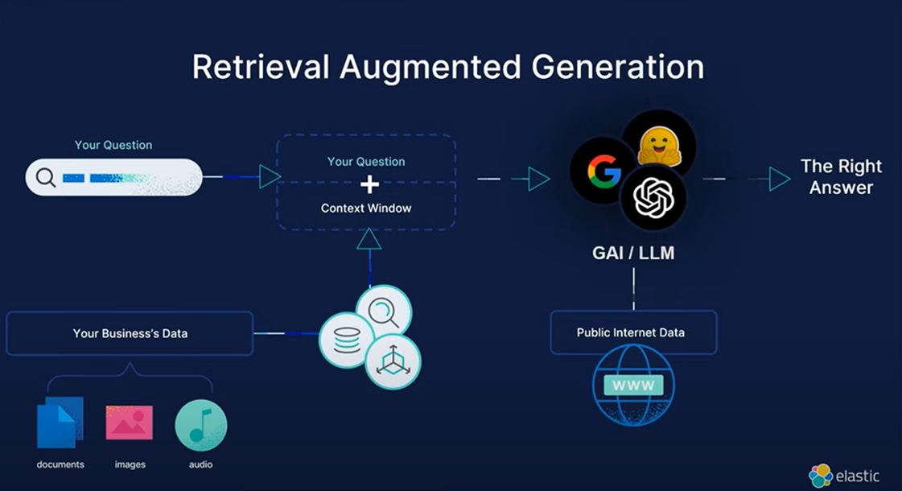

# Retrieval-Augmented Generation (RAG): A Comprehensive Guide

## What is RAG?
Retrieval-Augmented Generation (RAG) is an advanced technique that enhances the capabilities of large language models (LLMs) by incorporating external knowledge sources. By combining the generative power of LLMs with the retrieval capabilities of database searches, RAG systems can produce more accurate and contextually relevant responses.

## Why We Need RAG?
The primary need for RAG arises from the limitations of LLMs, which are trained on static datasets that might not always be up-to-date or comprehensive. RAG bridges this gap by allowing LLMs to access real-time, external information, thus improving their responses and making them more reliable and informative.

## Benefits of Using a RAG Setup in an Organization
- **Enhanced Accuracy**: By referencing up-to-date information, RAG can provide more accurate answers.
- **Contextual Relevance**: RAG systems can retrieve specific documents that are highly relevant to the user's query, ensuring that responses are contextually appropriate.
- **Knowledge Expansion**: Organizations can leverage vast external databases and knowledge sources, beyond their internal data, to enrich their AI applications.
- **Efficiency**: RAG reduces the need for manual updates to the AI's training data, as it can dynamically retrieve and use the latest information.

## What is the Difference Between Semantic Search and RAG?
- **Semantic Search**: Focuses on understanding the meaning behind the user's query and retrieving documents that match that meaning. It uses techniques like word embeddings and contextual search.
- **RAG**: Goes a step further by not only retrieving relevant documents but also using those documents to generate responses. RAG combines retrieval with generation, enhancing the AI's ability to provide detailed and accurate answers.

## How Does RAG Work and What Are the Steps?
1. **Indexing**: Data is prepared and indexed, typically by converting it into embeddings (numerical representations).
2. **Retrieval**: When a query is made, the system retrieves the most relevant documents based on similarity scores.
3. **Augmentation**: The retrieved documents are combined with the original query to create an augmented prompt.
4. **Generation**: The LLM generates a response based on the augmented prompt.

## How Can We Improve the Query Accuracy of RAG?
- **Query Translations**: Translate the user's query into multiple variations to capture different nuances and improve retrieval accuracy.
   - **Example Prompt**: "Translate the query 'What is the latest AI trend?' into French, German, and Spanish, and retrieve relevant documents in each language."
- **Query Decompositions**: Break down complex queries into simpler sub-queries to retrieve more precise information.
   - **Example Prompt**: "Decompose the query 'Explain quantum computing' into 'What is quantum computing?' and 'How does quantum computing work?' and retrieve relevant documents for each sub-query."
- **Chunking**: Split large documents into smaller chunks to improve retrieval efficiency and relevance.
   - **Example Prompt**: "Chunk the document 'Introduction to Machine Learning' into sections and index each section separately."
- **Re-Ranking**: Use additional algorithms to re-rank retrieved documents based on relevance and quality.
   - **Example Prompt**: "Retrieve documents related to 'climate change' and re-rank them based on citation count and publication date."
- **Dynamic Data Loading**: Continuously update the knowledge base to ensure the information is current.
   - **Example Prompt**: "Update the knowledge base with the latest research papers on 'neural networks' every month."
- **Feedback Loops**: Implement feedback mechanisms to learn from previous retrievals and improve future performance.
   - **Example Prompt**: "Analyze user feedback on retrieved documents and adjust the retrieval algorithm accordingly."
