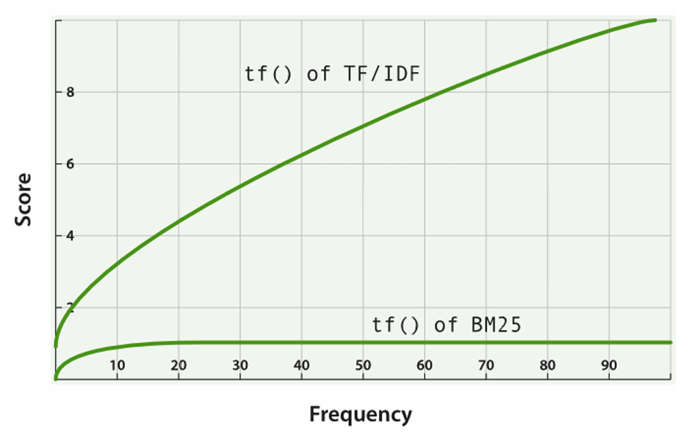
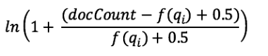
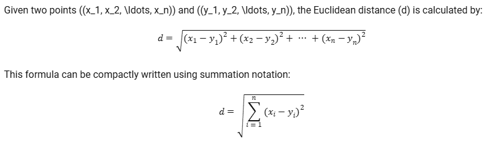
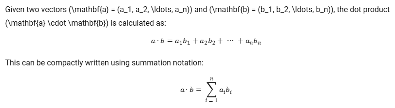
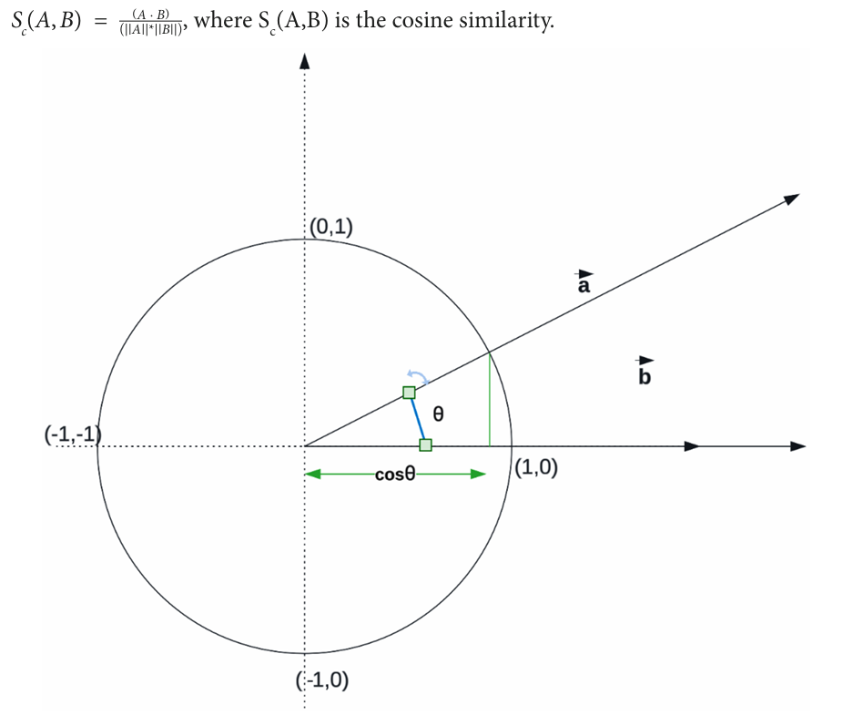

# Getting Started with Vector Search

## Data Type and its impact on relevancy
***Elasticsearch*** supports various data types. Among them, few can be categorized into two main types in the context of *relevancy ranking*. 
+ Data types which directly drives the *relevancy ranking*
	+ Text: It is used to store and search textual data. The *text data* is *analyzed* using built in *analyzers*. The *analyzers* break the text into *tokens* and perform operations such as *lowercasing, stemming, and filtering*.
	+ Geo: Used to store and search geographic coordinates. It enables to perform geo-based queries. Helps to narrow down search results and improve their relevancy. 
+ Data type that indirectly influence ranking
	+ Keyword: used to store *non-analyzed* text data. Mainly used for *filtering and aggregations*. It helps to refine the search results by filtering records aggregating. 
	+ Numeric Types (integer, float, double etc.): Used to store and search numeric data. Again useful to filter and sort search results. 
	+ Date: used to store and search date and time data. Used to filter and sort search results. 
		+ Boolean: used to store `true/false` values. Useful, to filter search results. 

## The ***Relevancy Model***

### TF-IDF Term Frequency-Inverse Document Frequency Algorithm 
Let's take an example: 
+ Document 1: "I love vector search. Vector search is amazing."
+ Document 2: "Vector search is a method for searching high-dimensional data."
+ Document 3: "Elasticsearch is a powerful search engine that supports vector search."

Let's see how we can calculate the *TF-IDF* score for the *term* **vector search** in each of the document. 

Calculating TF
+ Document 1: vector search appears twice out of 8 words -> TF = 2 / 8 = 0.25
+ Document 2: vector search appears once out of 9 words -> TF = 1/9 = 0.111
+ Document 3: vector search appears once out of 10 words -> TF = 1/10 = 0.110

Calculating IDF
Number of documents container the term *vector search* = 3

Total Number of Documents = 3

IDF = *log(3/3) = log(1) = 0*

Calculating TF-IDF
+ Document 1: TF-IDF = TF x IDF = 0.25 x 0 = 0
+ Document 2: TF-IDF = TF x IDF = 0.111 x 0 = 0
+ Document 3: TF-IDF = TF x IDF = 0.110 x 0 = 0

we can see when the search term is common, the TF-IDF score is very low. In this scenario its 0. TF-IDF algorithm penalizes common terms in the document collection, to reduce their impact on the relevance scores. 


+ Document 1: "I love vector search. Vector search is amazing."
+ Document 2: "Vector search is a method for searching high-dimensional data."
+ Document 3: "Elasticsearch is a powerful search engine that supports semantic search."

Let's calculate the TF-IDF score for term *semantic search* 

+ Document 1: 0 / 8 = 0
+ Document 2: 0 / 0 = 0
+ Document 3: 1/10 = 0.1

IDF = *log(3/1) = log(3)*  = 1.0986

+ Document 3: TF-IDF = 0.1 x 1.0986 = 0.10986
+ Document 2: TF-IDF = 0
+ Document 1: TF-IDF = 0

*TF-IDF* algorithm can lean to bias with longer documents. That's because they might have generally higher term frequencies. 

The IDF component is calculated as *log(N/df(t))*, where N is the total number of documents in the collection, and *df(t)* is the number of documents containing the term t. The IDF component aims to give more importance to rare terms and less importance to common terms.

The TF has no upper bound, which means that as the frequency of a term increases, its impact on the relevance score also increases linearly.

### *BM25*
The *BM25*, can increase the fidelity to data and refine the *TF-IDF* components of the equation. The *BM25* algorithm introduces a saturation component to the equation. This prevents extremely high term frequencies from dominating the *relevance score*. 



Calculating the *Relevance Score* using the *BM25* algorithm for the term *search*.  

+ Document 1: "I love vector search. Vector search is amazing."
+ Document 2: "Vector search is a method for searching high-dimensional data."
+ Document 3: "Elasticsearch is a powerful search engine that supports semantic search."

Below is the equation to calculate the *BM25 Relevance Score*


Calculating the TF for each document. 

+ Document 1: search appears 2 times out of 8 words: 0.403
+ Document 2: search appears 2 times out of 9 words: 0.390
+ Document 3: search appears 2 times out of 10 words: 0.377

Now IDF 



## The limits of *keyword-based* search
*Keyword* based search relies on exact matches between the user *query* and the *terms* contained in the *documents.* This approach could lead to missed relevant results if the search system is not refined enough with *synonyms, abbreviations, alternative phrasing, etc.* Since the *keyword* based searches lack context understanding, they don't take *context or meaning* of words into consideration when doing the search. Furthermore, *keyword* based search does not capture the structure or semantics of sentences. The order of the words can be very important to understand the meaning of the *query*. 

### How can we calculate the similarity of two vectors
#### Distance Metrics
#### Euclidean Distance



#### Dot Product


#### Cosine Similarity



When you have three options, the question which comes to our mind is when to use which. The answer depends on the use case, the text that has been vectorized, the domain and the vector shape. 

The Euclidean distance is often utilized when dealing with data that has a significant origin. In a 2D Cartesian coordinate system, this origin is the point (0,0). A significant origin holds importance or meaning within the context of the data being analyzed. Essentially, a significant origin is a point where all feature values are zero, and it has a clear interpretation within the problem domain. Example : Measuring temperatures

The dot product is particularly useful when dealing with data that includes both positive and negative values, and where the angle between vectors is not a concern. The dot product can yield positive, negative, or zero values. Since it is not normalized, the magnitudes of the vectors can influence the results.

Cosine similarity, derived from the dot product, normalizes the magnitudes of vectors and focuses on the angle between them, making it particularly suitable for text data. It measures the cosine of the angle between vectors, capturing their semantic similarity. Being normalized, with values ranging from -1 to 1, cosine similarity is less sensitive to the scale of the features and the magnitudes of the vectors.

The two important points which we need to understand are:
+ The direction which is defined by the angle between vectors
+ The magnitude
##### Directions and Magnitude
In the context of text data, vectors are typically created using word embeddings or document embeddings. These are dense vector representations that capture the semantic meaning of words or documents within a continuous vector space.

The direction and magnitude of these vectors are related to the actual text through the relationships between words in the dataset. The direction of a vector representation of text indicates its semantic orientation in the high-dimensional vector space. Vectors with similar directions represent semantically similar texts, sharing similar contexts or meanings. In other words, the angle between the vectors of two texts is small when the texts are semantically related.

In contrast, a large angle indicates that the texts have different meanings or contexts. This is why cosine similarity, which focuses on the angle between vectors, is a popular choice for measuring semantic similarity in text data.

The magnitude of a vector represents the weight of the text in the vector space. In some cases, this magnitude can relate to the frequency of words in the text or the importance of the text within the dataset. However, the magnitude can also be influenced by factors such as the length of the text or the presence of certain words, which might indicate semantic similarities.

When comparing texts in high-dimensional space, the direction is often more important than their magnitudes if the goal is to capture semantic similarity. This is because the angle directly represents the similarity between words.


## ***vector*** Data type and ***vector search query*** API
### ***sparce vector*** and ***dense vectors***

Dense Vectors
Dense Vectors are vectors in which most of the elements are non-zero. They provide a compact representation of data and are often used in deep learning and other machine learning algorithms.

Examples:
Word Embeddings: Techniques like Word2Vec, GloVe, and FastText generate dense vectors to represent words. For example, the word "apple" might be represented by a dense vector [0.52, 0.12, -0.75, 0.33, ...].

Image Embeddings: Convolutional Neural Networks (CNNs) produce dense vectors to represent features of images. Each dense vector contains values that encapsulate the visual features of the image.

Use Cases:
Natural Language Processing (NLP): Dense vectors are used to capture semantic relationships between words, sentences, or documents. This includes tasks like text classification, sentiment analysis, and machine translation.

Image Recognition: In image classification and object detection, dense vectors are used to represent the features of images, enabling the model to recognize and classify objects within the image.

Recommendation Systems: Dense vectors are used to capture user preferences and item characteristics, enabling personalized recommendations.

Sparse Vectors
Sparse Vectors are vectors in which most of the elements are zero. They are useful for representing data where only a few features are relevant or non-zero, such as in high-dimensional datasets.

Examples:
Bag-of-Words (BoW): In text processing, a BoW model represents a document by a sparse vector, where each dimension corresponds to a word in the vocabulary. If a word is present in the document, its corresponding element in the vector is non-zero.

One-Hot Encoding: In categorical data, one-hot encoding creates sparse vectors where only one element is non-zero, representing the category.

Use Cases:
Text Analysis: Sparse vectors are used in document classification and information retrieval. For example, a BoW representation can help in text categorization tasks.

Feature Selection: Sparse vectors help in representing high-dimensional data with only a few relevant features, reducing computational complexity in machine learning models.

Recommender Systems: Sparse vectors can represent user-item interactions where only a few interactions are non-zero, such as user ratings in a large catalog.

Key Differences
Density: Dense vectors have mostly non-zero elements, while sparse vectors have mostly zero elements.

Storage Efficiency: Sparse vectors are more storage-efficient for high-dimensional data with few non-zero elements.

Computation: Dense vectors allow for more efficient computations in deep learning, whereas sparse vectors are more efficient in memory usage for large datasets.

Use Cases
Dense Vectors: Used in scenarios requiring rich and detailed feature representations, such as NLP and image recognition tasks.

Sparse Vectors: Used in scenarios with high-dimensional data and few relevant features, such as text classification with BoW and user-item interaction matrices in recommender systems.


### Setting up a *mapping* with *dense-vector* type field

```json
{
	"mappings": {
		"properties": {
			"embedding": {
				"type": "dense_vector",
				"dims": 768,
			}
		}
	}
}
```

let's see an example using *elasticsearch* with *python* 

### Brute force kNN Search
The *vector field* is not *indexed* by default. This means you cannot use it with the *kNN endpoint*. But we can use *vectors* in the *script score function*, with a couple of *similarity functions* to perform *brute-force or exact kNN search*. 

The *script scoring query* is useful when we want to avoid applying the scoring function on all documents which gets searched, and only apply it on the filtered set of documents. Downside of that is that the more filtered the document, the more expensive the script score can be. 

The out of the box *similarity functions*. 
+ `CosineSimilarity`: Calculates the *cosine* similarity
+ `dotProduct`: Calculates the dot product
+ `l1norm`: Calculates the L1 distance
+ `l2norm`: Calculates the L2 distance
+ doc[field name].vectorValue: Returns the vectors value as an array of floats   
+ doc[field name>].magnitude: Returns a vectors' magnitude

As a rule of thumb, if the number of documents after filtering is under 10,000 documents, then not indexing and using one of the similarity functions should give good performance.

The last two options refer to situations where you want to access vectors directly. While it gives an important level of control to users, the performance of the code will depend on how narrowed down the document set is and the quality of the script on multidimensional vectors.

### kNN Search

#### Change needed to the *mapping*

```json
{
	"mappings": {
		"properties": {
			"embedding": {
				"type": "dense_vector",
				"dims": 768,
				"index": true,
				"similarity": "dot_product",
			}
		}
	}
}
```

The three options for similarity are `l2_norm`, `dot_product`, and `cosine`. We recommend using `dot_product` for vector search in production whenever possible. Using the dot product eliminates the need to calculate vector magnitudes for each similarity computation, as the vectors are pre-normalized to have a magnitude of 1. This can improve search and indexing speed by approximately 2-3 times.

The difference with the brute-force kNN search based on the script scoring query is that, in this case, the HNSW graph is built and stored in memory. Specifically, it is stored at the segment level, and this is why:
+ Force merging is recommended at the index level to merge all segments in an index into a single segment. This not only optimizes search performance but also prevents HNSW from being rebuilt at any segment. To merge all segments, you can use the following API:
	+ `POST /my-index/_forcemerge?max_num_segments=1`
+ Updating a document is not recommended at scale. Because that would rebuild the HNSW again

The kNN search API helps find the k approximate nearest neighbors to a query vector. This query is a vector of numbers representing the text search query. The k nearest neighbors are the documents with vectors most similar to the query vector.

In kNN search, the API initially identifies a specified number of approximate nearest neighbor candidates on each shard, referred to as `num_candidates`. It then calculates the similarity between these candidates and the query vector, selecting the k most similar results from each shard. Finally, the results from all shards are merged to determine the top k nearest neighbors in the entire dataset.